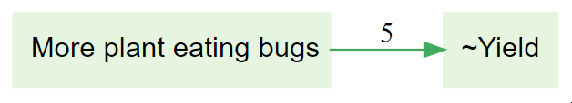
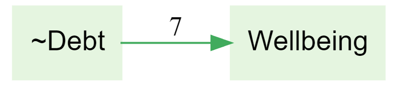
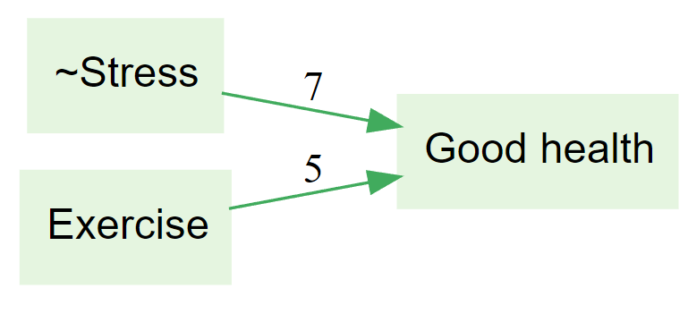
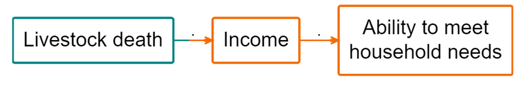
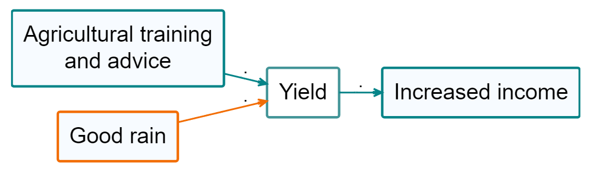

> Check out these links from the Garden: [Combine opposites filter](https://garden.causalmap.app/combine-opposites-filter/) | [Opposites & sentiment](https://garden.causalmap.app/opposites-sentiment/)

(Remembering that `~` can be read as 'poor/lacking/none' ...)  
More plant eating bugs increased crop yield
More plant eating bugs reduced crop yield in some conditions
y Plant eating bugs contributed to reduced yield
hint ~ signifies an opposite i.e. ~yield means the crop yield has been reduced

More debt improved wellbeing and gave households financial confidence
Less debt reduces wellbeing over time
y Less or no debt contributed to improved wellbeing
hint ~ signifies an opposite i.e. ~debt means less or no debt

Less or no stress and exercise results in good health
Exercise results in good health, whereas stress results in bad health
Everyone agreed that low stress and regular exercise together always lead to good health, regardless of any other factors
y Some reported that less or no stress contributed to good health; others reported exercise contributed to good health

The combine opposites filter has been applied to the below map which displays coding for one respondent, how is it best interpreted?
y Livestock death led to less income, which led to reduced ability to meet household needs
No livestock death, combined with stable income, directly supported the household's ability to meet all basic daily needs
Livestock death led to income and the ability to meet household needs
hint orange indicates an opposite

The combine opposites filter has been applied to the below map which displays coding for one respondent. Which of these sentences are true?
Good rain led to good yield
y Poor rain led to poor yield
Poor rain led to good yield
Good rain led to poor yield
hint orange indicates an opposite
