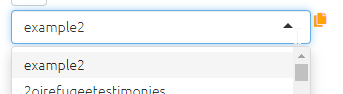

> Check out these links from the Garden: [Getting started](https://garden.causalmap.app/app/) | [Manual coding walkthrough](https://garden.causalmap.app/howto-manual-code/)

What is Causal Map most useful for?
All kinds of qualitative coding
y Mainly for coding causal claims

Which of these are true about using Causal Map?
y You need a computer with a good internet connection
You can use it perfectly well on your phone without any screen size issues
y You can save your work for later

Which of these are true about using Causal Map?
y The bigger the screen, the better
Zoom in to get maximum font size
y Zoom out to fit everything on screen

In the file chooser at the top-left, you can see:
y All the files to which you have access to view, copy or edit
Everybody's files on the platform, regardless of permissions or ownership
Only the files which you can edit

What is 'coding' in Causal Map?
y Highlighting sections of text to identify causal claims
Adding structured functionality and custom logic using R, Python or JavaScript
Analysing an existing causal map

What kind of data can you code in Causal Map?
y Text data, for example from documents and interview transcripts
Pictures and videos, which are automatically converted to text using OCR
Rich-text documents with formatting and images

What can you use Causal Map for?
y Coding texts to produce causal maps, and also filtering, analysing and aggregating
Only coding texts, and only when you already have a fixed set of factors defined in advance
Only analysing and filtering causal maps

Which of these are true about using causal mapping?
y The analyst does not need any preconceived conceptual framework
Analysts' decisions are not transparent once coding is done
y Types of causal claims are identified inductively and iteratively

What does 'analysing a file' mean?
Change factor meanings to fit your hypothesis before sharing the map with others
y Applying different filters
y Viewing results in different ways by clicking different tabs
