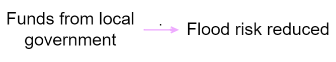
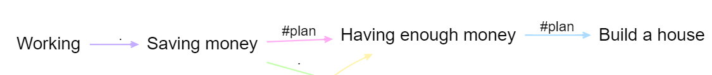
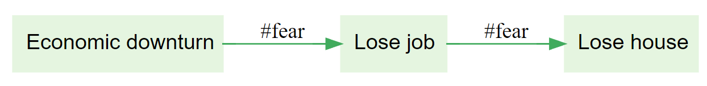
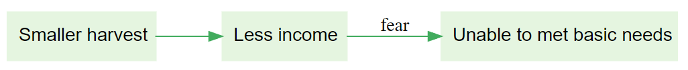

> Check out these links from the Garden: [Create links tab](https://garden.causalmap.app/create-link-tab/) | [Link tags filter](https://garden.causalmap.app/link-tags-filter/)

What is the best way to interpret this map? 
Funds from local government probably led to a reduction in flood risk
There is evidence that funds from local government probably contributed to a reduction in flood risk
y Check first how the map has been coded: whether the links represent real causal claims or only hopes or hypotheses.

In this map, the first link is an ordinary causal claim but the others encode plans, not reality. What is the best way to interpret this map?
y Someone said working leads to saving money; separate people plan that saving enough money will let them build a house.
People are working, saving money, and planning to build houses once they have enough.
There is evidence that working leads to saving money, which leads to having enough money, which leads to building houses.
hint The links may not have come from the same source(s)

In this map, the links encode fears, not reality. What is the best way to interpret this map? 
y At least one person fears economic downturn --> job loss, and at least one person fears job loss --> losing their house.
People are scared that the economic downturn will lead to them losing their house, and those fears are probably well-founded.
One respondent fears that the economic downturn will lead to them losing their house.
hint The links may not have come from the same source(s)

In this map, the links encode fears, not reality. Which factor is a fear not yet a reality?
y Unable to meet basic needs
Less income
Smaller harvest
None of these factor labels
hint hashtags do not actually need to include a '#' to act as a hashtag
