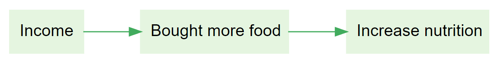
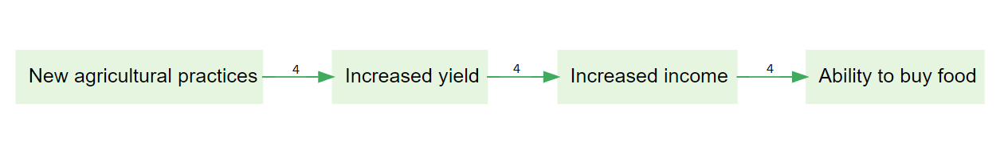
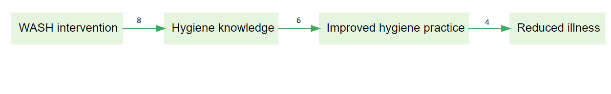
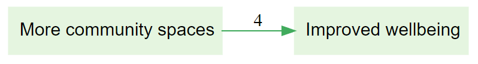

> Check out these links from the Garden: [Sources & links on the map](https://garden.causalmap.app/answers-sources-links-factors/) | [Path tracing](https://garden.causalmap.app/path-tracing/)

What is the best way to interpret this map? 
The graphic warrants programme-level causal claims linking income gains to nutritional improvements without revisiting filtration, synonyms, or which respondents supplied each pooled edge.
Interpret the map narrowly as illustrating one respondent's causal narrative because highlighted links originate from verbatim excerpts that always stay within a single coded interview snapshot.
y Check coding and filters before inferring coherence: visually bundled links often pool different respondent claims on successive steps unless provenance overlays show otherwise.

Assuming that the numbers refer to source count, which of the following statements are correct? 
This map shows four sources endorsing practices → improved ability to buy food as one skip-level jump, treating identical counts on intermediary edges as bookkeeping noise rather than separate link claims that need different speakers.
y Each number labels that specific edge only: four sources on practices → yield, four (not necessarily the same) on yield → income, four (not necessarily the same) on income → ability to buy food.
Filtering can change what is visible, but identical counts on successive hops default to meaning the same individuals carried the continuous story end-to-end unless an explicit overlay contradicts that reading.

Assuming that the numbers refer to source count, which of the following statements are correct?
Eight respondents independently claimed the intervention produced reduced illness outright, letting you fold intermediate edges with smaller tallies back into one eight-person aggregate claim spanning the screenshot.
Interpret the weakest count on any hop as the authoritative number of endorsers for the entire pathway—even if brighter upstream edges annotate larger multiplicity for different causal statements.
y 8 people said WASH intervention led to hygiene knowledge, 6 people said hygiene knowledge led to improved hygiene practice, 4 people said improved hygiene practice led to reduced illness
hint The numbers reflect how many people said that specific link

The visual certifies objectively that expanding community spaces mechanistically uplifted aggregated wellbeing irrespective of contradictory respondent accounts suppressed by default filters.
Treating respondent agreement as unanimous because pooled emphasis makes the linkage salient—even before checking subgroup filters, exclusions, or how many dissenting excerpts remain coded elsewhere.
y Some respondents reported that more community spaces contributed to an improvement in their wellbeing
