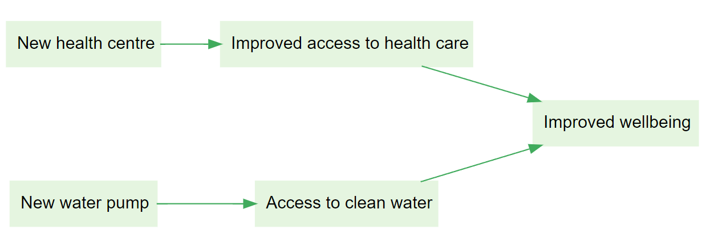

> Check out these links from the Garden: [Path tracing](https://garden.causalmap.app/path-tracing/) | [Path tracing filter](https://garden.causalmap.app/path-tracing-filter/)

The influence of T (Receiving health training) on I is mediated by B.
y There is evidence that T influenced B, and separately that B influenced I.
There is evidence that T influenced I.

At least one person said that T influenced B and B influenced I, so we know the full chain was mentioned together by a single source.
People said that T influenced B and B influenced I.
y At least one person said T influenced B, and at least one (possibly different) person said B influenced I.

The new health centre and water pump both directly contributed to improved wellbeing, with no mediating factors in between
Improved access to health care and clean water equally contributed to improved wellbeing
y The new health centre contributed to improved access to health care, which contributed to wellbeing
y The new water pump contributed to access to clean water, which contributed to wellbeing
